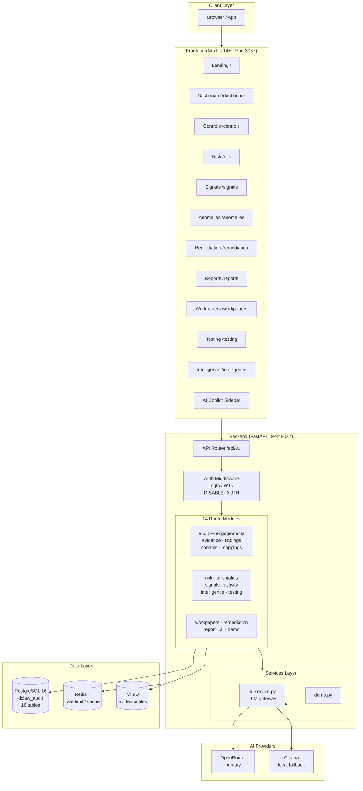
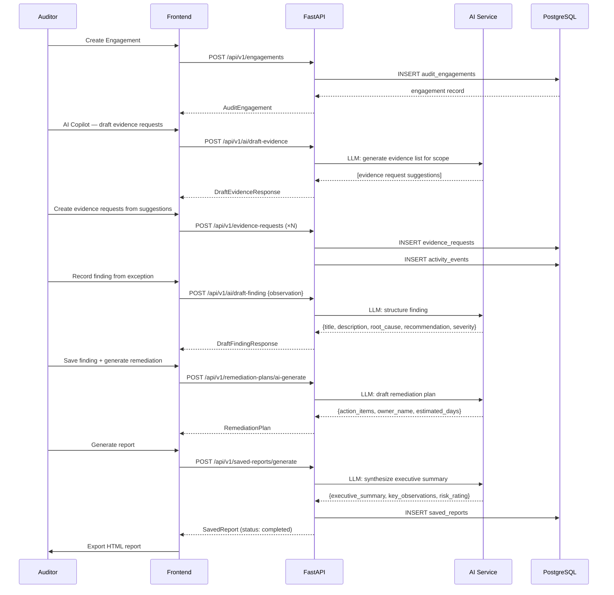
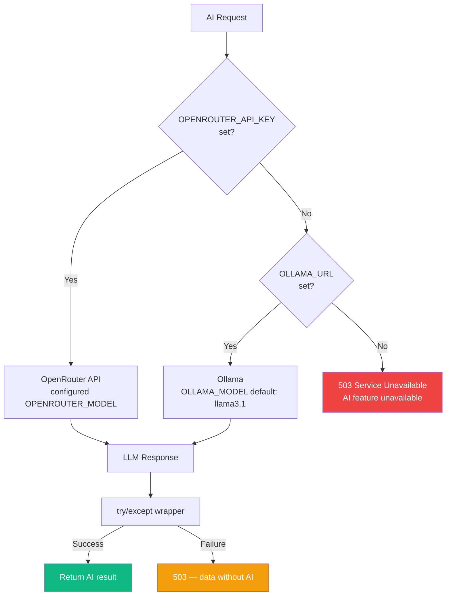
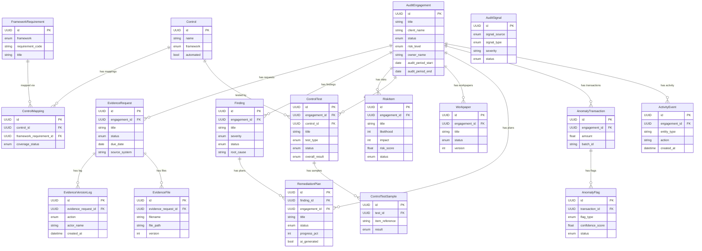
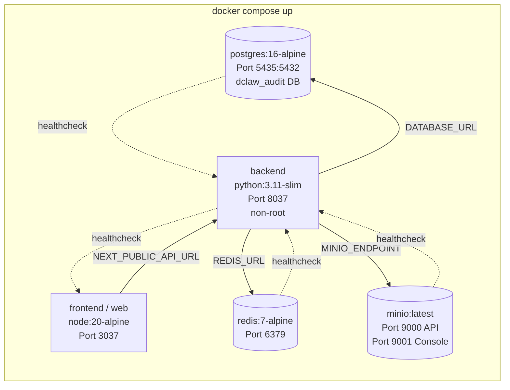
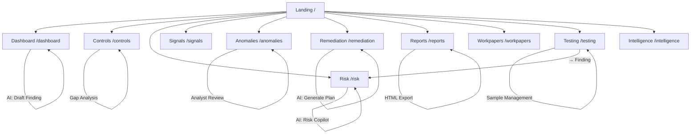

# DClaw Audit — Architecture Diagrams

> Source diagrams for infographic regeneration. Rendered with Mermaid.
> Version: 1.4 · Updated: 2026-05-31

---

## 1. System Architecture



---

## 2. Audit Workflow — End-to-End Flow



---

## 3. AI Provider Selection



---

## 4. Data Model — Entity Relationships



---

## 5. Control Testing Pipeline

```mermaid
flowchart LR
    subgraph Plan["Test Planning"]
        CT[Create ControlTest\ntype: manual / automated\n/ sample_based]
        SA[Define test_objective\ntest_procedure\nsample_size]
    end

    subgraph Execute["Test Execution"]
        SM[Add ControlTestSample\nitems per sample]
        RR[Record result per sample\npass / fail / exception]
    end

    subgraph Review["Review & Close"]
        EX[Count exceptions_found]
        OR[Set overall_result\npass / fail / exception]
        RV[Reviewer sign-off\nreviewer_name]
        CO[status: completed]
    end

    subgraph Output["Finding Generation"]
        FI[Create Finding\nfrom exceptions]
        RP[AI: generate-remediation-plan]
    end

    CT --> SA --> SM --> RR --> EX --> OR --> RV --> CO
    CO -->|exceptions exist| FI --> RP
```



---

## 6. Anomaly Detection Pipeline

```mermaid
flowchart TD
    subgraph Ingest["Data Ingestion"]
        BI[POST /anomaly-transactions\n/bulk-ingest\nbatch_id + transactions]
        SI[POST /anomaly-transactions\nsingle transaction]
    end

    subgraph Detect["Detection Engine"]
        RB[Rule-Based\nthreshold / pattern checks]
        ST[Statistical\nz-score / outlier detection]
        CF[confidence_score 0.0–1.0]
    end

    subgraph Flag["Flag Creation"]
        FL[AnomalyFlag\nflag_type: rule_based / statistical\nstatus: flagged]
    end

    subgraph Review["Analyst Review"]
        AN[Analyst reviews flag\nPATCH /anomaly-flags/{id}]
        CL[status: cleared]
        ES[status: escalated]
        RV[status: reviewed + notes]
    end

    BI --> RB
    BI --> ST
    SI --> RB
    SI --> ST
    RB --> CF --> FL
    ST --> CF
    FL --> AN
    AN --> CL
    AN --> ES
    AN --> RV
```

---

## 7. Docker Compose Service Map



---

## 8. Screen Navigation Map



---

## 9. Intelligence Layer — Analytics Sources

```mermaid
flowchart LR
    subgraph Sources["Data Sources (cross-engagement)"]
        CT[ControlTest results\n{pass, fail, exception}]
        ER[EvidenceRequest\noverdues + response times]
        FI[Finding\naging + status]
        EG[AuditEngagement\ncycle times]
    end

    subgraph Compute["Intelligence Aggregations"]
        RC[Recurring Control Failures\nfailure_rate per control]
        OR[Owner Responsiveness\navg days open, overdue %]
        CB[Cycle Time Benchmarks\ndays open per engagement]
        KP[KPI Trends\n30d / 60d finding counts]
    end

    subgraph Output["GET /intelligence/summary"]
        IS[IntelligenceSummary\nrecurring_control_failures\nowner_responsiveness\ncycle_time_benchmarks\nfindings_trend_30d/60d]
    end

    CT --> RC
    ER --> OR
    FI --> CB
    FI --> KP
    EG --> CB
    RC --> IS
    OR --> IS
    CB --> IS
    KP --> IS
```

---

## 10. AI Feature Cost Map

| Feature | Endpoint | Model Tier | Cache |
|---------|---------|-----------|-------|
| Draft evidence requests | `/ai/draft-evidence` | Standard | None |
| Risk copilot | `/ai/risk-copilot` | Standard | None |
| Draft finding | `/ai/draft-finding` | Standard | None |
| Generate report | `/ai/generate-report` | Standard | None |
| Evidence completeness check | `/ai/check-evidence-completeness` | Standard | None |
| Prioritize findings | `/ai/prioritize-findings` | Standard | None |
| Generate remediation plan | `/ai/generate-remediation-plan` | Standard | None |
| Saved report generation | `/saved-reports/generate` | Standard | SavedReport DB record |

All calls through `ai_service.py`. All wrapped in try/except — 503 on provider failure.
